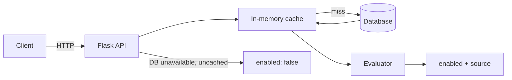

# Feature Flags API

REST API for boolean feature flags with regional segmentation, per-flag percentage rollout, in-memory caching, and persistent storage. Includes flag CRUD, contextual evaluation, a browser playground, Postgres on DigitalOcean App Platform, and GitHub Actions CI/CD.

## Architecture

Request lifecycle, caching layer, and storage layer:



1. Client calls the evaluate endpoint with a user context (query parameters such as `region` and `user_id`).
2. API loads the flag from the in-memory cache, or from the database on a cache miss.
3. Evaluator checks whether the context's `segment_key` value (e.g. `region`) is marked eligible (`true`) in the flag's `segments` map.
4. If eligible, the flag is enabled only when the user's `user_id` is also in that flag's rollout bucket (see [Percentage rollout](#percentage-rollout)); response `source` is `segment_and_rollout` when both pass, otherwise `segment` with `enabled: false`.
5. Segment value not listed in `segments` (e.g. `eu-central`) or missing from context → `default_state` with `source: default`.
6. Database unavailable and flag not cached → cannot load flag config; evaluate returns `enabled: false` with `source: default_fallback` (fail closed).

Cache is updated on flag reads and invalidated on flag updates and deletes.

## API

| Method | Path | Description |
|--------|------|-------------|
| `GET` | `/health` | Liveness check |
| `GET` | `/flags` | List flags |
| `POST` | `/flags` | Create a flag |
| `GET` | `/flags/{name}` | Get a flag |
| `PUT` | `/flags/{name}` | Update a flag |
| `DELETE` | `/flags/{name}` | Delete a flag |
| `GET` | `/flags/{name}/evaluate?...` | Evaluate for context |
| `GET` | `/` | Browser playground |

## Setup

```bash
python -m venv .venv
source .venv/bin/activate
pip install -r requirements-dev.txt

flask --app app run --debug
pytest
```

Locally the app uses SQLite (`flags.db`). On App Platform, `DATABASE_URL` from [`.do/app.yaml`](.do/app.yaml) connects to Postgres.

Create a flag before evaluating. Each flag accepts an optional `rollout_percent` (0–100, default `0`). Example: `dark_mode` segmented by `region` with a 25% rollout:

```bash
curl -X POST http://127.0.0.1:5000/flags \
  -H 'Content-Type: application/json' \
  -d '{
    "name": "dark_mode",
    "default_state": false,
    "segment_key": "region",
    "segments": { "us-east": false, "us-west": true },
    "rollout_percent": 25
  }'
```

Open `http://127.0.0.1:5000/` for the playground UI (create, list, evaluate, health).

## Evaluation payload examples

Evaluate with a user context via query parameters on:

`GET /flags/{name}/evaluate`

**Context (conceptual):**

```json
{ "user_id": "u-1", "region": "us-west" }
```

**Request:**

```bash
curl "http://127.0.0.1:5000/flags/dark_mode/evaluate?user_id=u-1&region=us-west"
```

**Response:**

```json
{
  "flag": "dark_mode",
  "enabled": false,
  "source": "segment"
}
```

**More examples** (flag created with `rollout_percent: 25` as above):

| Context | Result | `source` |
|---------|--------|----------|
| `{ "region": "us-west", "user_id": "u-1" }` | `enabled: false` | `segment` (eligible region, outside rollout bucket) |
| `{ "region": "us-west", "user_id": "user-2" }` | `enabled: true` | `segment_and_rollout` |
| `{ "region": "us-east", "user_id": "user-2" }` | `enabled: false` | `segment` (region not eligible; rollout does not override) |
| `{ "region": "eu-central" }` | `enabled: false` | `default` (`default_state` for unlisted regions) |
| `{ "user_id": "u-3" }` (no region) | `enabled: false` | `default` |

```bash
curl "http://127.0.0.1:5000/flags/dark_mode/evaluate?region=us-west&user_id=u-1"
curl "http://127.0.0.1:5000/flags/dark_mode/evaluate?region=us-west&user_id=user-2"
curl "http://127.0.0.1:5000/flags/dark_mode/evaluate?region=eu-central"
```

## Percentage rollout

Each flag stores its own `rollout_percent` (integer 0–100). Rollout is **not** hardcoded globally — different flags can use different percentages.

Assignment is **deterministic**: the same `user_id` always lands in the same bucket for a given flag, so repeated evaluations are stable across requests and deploys.

```
bucket = int(sha256(user_id).hexdigest()[:8], 16) % 100
in_rollout = bucket < rollout_percent
```

A flag is enabled only when **both** conditions hold:

1. The context segment value is present in `segments` and set to `true`.
2. `user_id` is present and `in_rollout` is true.

If the segment is eligible but the user is outside the rollout bucket, the flag stays off (`source: segment`). Rollout does not enable users in segments marked `false`. Without a `user_id` in the context, rollout never applies.

Set `rollout_percent` to `0` to disable rollout gating for that flag; set it to `100` to include every user that has a `user_id`.

**`default_state`** applies when the context segment value is missing or not listed in `segments` (e.g. `eu-central`). Rollout does not apply on that path — only explicit segment matches are rollout-gated.

## CI/CD

[`.github/workflows/ci-cd.yml`](.github/workflows/ci-cd.yml):

- **Push and pull requests to `main`:** run `pytest`
- **Push to `main`:** deploy to App Platform via `digitalocean/app_action/deploy@v2`, applying [`.do/app.yaml`](.do/app.yaml)

Add a repository secret `DIGITALOCEAN_ACCESS_TOKEN` (DigitalOcean API token with Apps access). App spec sets `deploy_on_push: false`; GitHub Actions owns deploys.

Verify a deployed app:

```bash
APP_URL=https://your-app.ondigitalocean.app ./scripts/verify_do_postgres.sh
```
