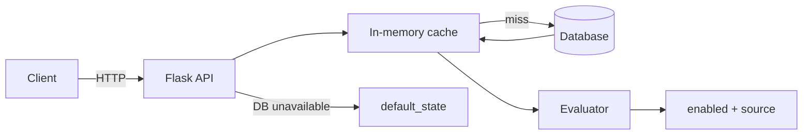

# Feature Flags API

REST API for boolean feature flags with regional segmentation, in-memory caching, and persistent storage. Includes flag CRUD, contextual evaluation, a browser playground, Postgres on DigitalOcean App Platform, and GitHub Actions CI/CD.

## Architecture

Request lifecycle, caching layer, and storage layer:



1. Client calls the evaluate endpoint with a user context (query parameters).
2. API loads the flag from the in-memory cache, or from the database on a cache miss.
3. Evaluator matches `segment_key` against the context (e.g. `region`) using the flag's `segments` map.
4. Known segment → boolean result; unknown or missing → `default_state`.
5. If the database is unavailable and the flag is not cached → `default_state` with `source: default_fallback`.

Cache is updated on flag reads and invalidated on flag updates and deletes.

## API

| Method | Path | Description |
|--------|------|-------------|
| `GET` | `/health` | Liveness check |
| `GET` | `/flags` | List flags |
| `POST` | `/flags` | Create a flag |
| `GET` | `/flags/{name}` | Get a flag |
| `PUT` | `/flags/{name}` | Update a flag |
| `DELETE` | `/flags/{name}` | Delete a flag |
| `GET` | `/flags/{name}/evaluate?...` | Evaluate for context |
| `GET` | `/` | Browser playground |

## Setup

```bash
python -m venv .venv
source .venv/bin/activate
pip install -r requirements-dev.txt

flask --app app run --debug
pytest
```

Locally the app uses SQLite (`flags.db`). On App Platform, `DATABASE_URL` from [`.do/app.yaml`](.do/app.yaml) connects to Postgres.

Create a flag before evaluating (example: `dark_mode` segmented by `region`):

```bash
curl -X POST http://127.0.0.1:5000/flags \
  -H 'Content-Type: application/json' \
  -d '{
    "name": "dark_mode",
    "default_state": false,
    "segment_key": "region",
    "segments": { "us-east": false, "us-west": true }
  }'
```

Open `http://127.0.0.1:5000/` for the playground UI (create, list, evaluate, health).

## Evaluation payload examples

Evaluate with a user context via query parameters on:

`GET /flags/{name}/evaluate`

**Context (conceptual):**

```json
{ "user_id": "u-1", "region": "us-west" }
```

**Request:**

```bash
curl "http://127.0.0.1:5000/flags/dark_mode/evaluate?user_id=u-1&region=us-west"
```

**Response:**

```json
{
  "flag": "dark_mode",
  "enabled": true,
  "source": "segment"
}
```

**More examples:**

| Context | Result | `source` |
|---------|--------|----------|
| `{ "region": "us-east" }` | `enabled: false` | `segment` |
| `{ "region": "eu-central" }` | `enabled: false` | `default` |
| `{ "user_id": "u-2" }` (no region) | `enabled: false` | `default` |

```bash
curl "http://127.0.0.1:5000/flags/dark_mode/evaluate?region=us-east"
curl "http://127.0.0.1:5000/flags/dark_mode/evaluate?region=eu-central"
```

## CI/CD

[`.github/workflows/ci-cd.yml`](.github/workflows/ci-cd.yml):

- **Push and pull requests to `main`:** run `pytest`
- **Push to `main`:** deploy to App Platform via `digitalocean/app_action/deploy@v2`, applying [`.do/app.yaml`](.do/app.yaml)

Add a repository secret `DIGITALOCEAN_ACCESS_TOKEN` (DigitalOcean API token with Apps access). App spec sets `deploy_on_push: false`; GitHub Actions owns deploys.

Verify a deployed app:

```bash
APP_URL=https://your-app.ondigitalocean.app ./scripts/verify_do_postgres.sh
```
